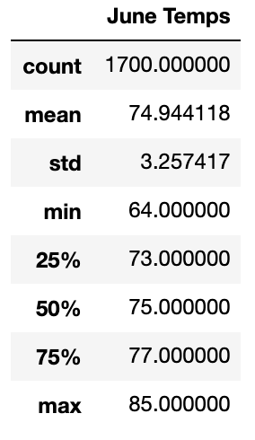
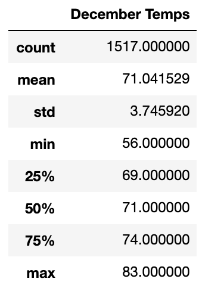
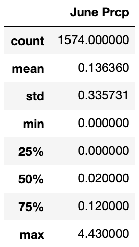
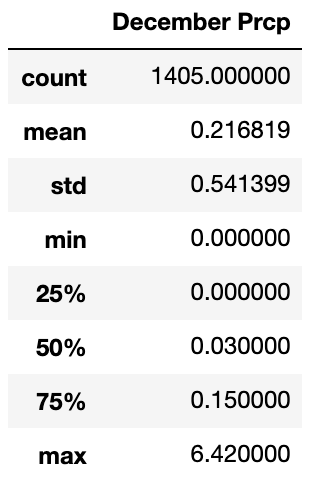

# surfs_up

## Project Overview
While visiting Hawaii, I identified multiple potential entrepreneurial opportunities and have decided to live in Oahu full time. I would like to open a surf and shake shop, but I require an investor to help to get this business started. After putting together a business plan, I had reached out to a local investor by the name of W.Avy. However, he would like to see more analysis of the weather patterns in Oahu before proceeding further.

## Purpose
Although W.Avy finds our initial business plan useful, he would like more information regarding temperature trends in Oahu before he chooses to invest in the surf shop. He hopes that this business will be sustainable all year around but would like to examine and compare the months of June and December in order to see if there will be a shift in demand. To do so, I have employed Python (Pandas) and SQLAlchemy queries to create a data frame that illustrates a statistical summary of the minimum, maximum, and average temperatures for the respective months. This analysis will provide W.Avy with all the information he requires to make the decision of whether or not to invest.

## Results
•	The statical analysis performed on the recorded temperatures in the month of June illustrates that the mean temperature for the month was approximately 74.9 degrees Fahrenheit (23.8 degrees Celsius). The mean temperature suggests that the temperatures are relatively warm and will provide prime surfing and ice cream weather, with the minimum temperature (64 degrees Fahrenheit) only decreasing by approximately ten degrees and the maximum temperature (85 degrees Fahrenheit) increasing about ten degrees. The Standard deviation (3.3) indicates that the temperatures don’t vary extensively, rather a significant majority of the data fairs within 3.3 standard deviations of the mean.

•	Additionally, the statical summary completed on the temperatures experienced in the month of December indicates that the average temperature remains around 71 degrees Fahrenheit (21.6 degrees Celsius). This is still relatively warm and does afford good surfing conditions, wherein the minimum temperature reached In December was 56 degrees Fahrenheit, and the maximum is 83 degrees Fahrenheit. Although the minimum temperature does raise questions about the quality of the surfing conditions, the standard deviation (3.7) indicates that a majority of the temperatures in December fair around the mean. Thus, it is unlikely that the minimum temperature in Oahu is experienced often.

•	When comparing the summary statistics between the months of June and December, it can be determined that the temperatures experienced in both months are statistically similar and do not considerably differentiate. More specifically, the mean temperatures only vary approximately 3.9 degrees Fahrenheit. Similarly, because both data sets have relatively comparable standard deviations it’s deduced that the overall temperatures for both months reflect that business should not substantially differ between the months.  

## Summary
From the analytical evidence provided above by the summary statistics tables, it is believed that the surf shop would continue to be successful all year around as the temperatures are relatively analogous. However, because W.Avy had previously invested in a surf shop that was unsuccessful due to large amounts of precipitation, it is useful to conduct further inquiry regarding the precipitation rates during these months. 

## Additional Queries

The summary statistics of the precipitation data indicate that the month of June receives on average 0.13 mm of rain, and approximately 0.21mm of rain in December. Nonetheless, the June and December statistics reveal that their respective standard deviation signifies minimal variation of precipitation measurements throughout the months. Therefore, the accumulation of rain should not greatly affect surfing conditions. With this additional analysis in mind, I believe W.Avy will be happy to know that the prevailing weather conditions according to data from the past year should not negatively affect business at the surf shop.

